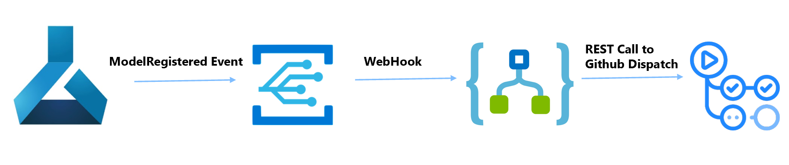

## Createing CD + CD with Github Actions

<https://learn.microsoft.com/en-us/azure/machine-learning/how-to-github-actions-machine-learning?tabs=userlevel>

for bootstrapping your own MLOps projects.

## Steps to Deploy

Clone this repository to your own GitHub organization and follow the steps below to deploy the demo.

1. [Create an Azure Service Principal and configure GitHub actions secrets.](#configure-github-actions-secrets)
2. [Configure dev and/or stage environments](#create-envoronments)
3. [List of GitHub Flows](#list-of-github-flows)
4. [Use a GitHub workflow to create Azure ML dataset, environment and run pipeline.](#train-prediction-model-using-pipeline)
5. [Use a GitHub workflow to publish model to managed endpoint.](#deploy-the-registered-model-to-an-online-endpoint)
6. [Use a GitHub workflow to publish model to managed endpoint based on Registry Event](#deploy-the-registered-model-to-an-online-endpoint-based-on-registry-event)

---

## Configure GitHub Actions Secrets

   This step creates a service principal and GitHub secrets to allow the GitHub action workflows to create and interact with Azure Machine Learning Workspace resources.
   
   From the command line, execute the following Azure CLI command with your choice of a service principal name:
   
   > `# az ad sp create-for-rbac --name <service_principal_name> --role contributor --scopes /subscriptions/<subscription_id> --sdk-auth`
   
   You will get output similar to below:

   >`{`  
   > `"clientId": "<service principal client id>",`  
   > `"clientSecret": "<service principal client secret>",`  
   > `"subscriptionId": "<Azure subscription id>",`  
   > `"tenantId": "<Azure tenant id>",`  
   > `"activeDirectoryEndpointUrl": "https://login.microsoftonline.com",`  
   > `"resourceManagerEndpointUrl": "https://management.azure.com/",`  
   > `"activeDirectoryGraphResourceId": "https://graph.windows.net/",`  
   > `"sqlManagementEndpointUrl": "https://management.core.windows.net:8443/",`  
   > `"galleryEndpointUrl": "https://gallery.azure.com/",`  
   > `"managementEndpointUrl": "https://management.core.windows.net/"`  
   > `}`
   
   Copy all of this output, braces included. From your GitHub project, select **Settings**
   Select **New repository secret**. Name this secret **AZURE_CREDENTIALS** and paste the service principal output as the content of the secret.  Select **Add secret**.
   

    

 ## Create Environments
From your GitHub project, select **Settings**

    

Select **Add Environment variable**. Name this variable **RESOURCE_GROUP** and **WORKSPACE_NAME**
  

    

 

---

 ## List of Github Flows

   In your GitHub project repository, select **Actions**

   This will display the pre-defined GitHub workflows associated with your project. For a classical machine learning project, the available workflows will look similar to this:

 - `run-model-training.yml` - creates dataset, environment and submits pipeline to train and register model. `train pipline model` job
 - `deploy-model-endpoint.yml` - deployes model to online endpoint based on manual trigger or push `deploy model to endpoint` job
 - `deploy-model-on-event.yml` - deployes model to online endpoint based on event Model Registered received from EventGrid + LogicApp. `deploy model to endpoint on event` job
 - `run-model-pipeline-nowait.yml` - simple pipeline creation script

    

 
---

## Train Prediction Model using Pipeline

The https://github.com/sdonohoo/mlops-cv-demo/blob/main/.github/workflows/run-model-training.yml GitHub workflow creates the training dataset and environment in Azure ML. Then it creates an Azure ML pipeline with a few  components that trains and registers  model.

To create the model training pipeline in the previously created Azure ML workspace, select **Actions** in your GitHub project repository. 
Then select the `train-pipeline-model`.

    

As before, select  **Run workflow** on the right and select the branch to run from. This will run the workflow, register the dataset, and deploy the training pipeline in Azure ML.

Once the run-model-training-pipeline job begins running, you can follow the execution of this job in the Azure ML workspace. 

When the Azure ML pipeline completes, the trained model should be registered in the workspace.

Next, the registered model will be deployed to a real-time endpoint for predictions.

---

## Deploy the Registered Model to an Online Endpoint

This step uses a GitHub workflow to deploy the registered model to an Azure ML Managed Online Endpoint for predicting the class of new images.

This workflow will register the interference environment with prerequisite python packages, create an Azure ML endpoint, create a deployment of the registered model to that endpoint, then allocate traffic to the endpoint.

To run the workflow to deploy the registered model as a managed online endpoint, select **Actions** in your GitHub project repository.
Then select the `deploy-pipeline-model`.

    

Run the workflow.

As the create-endpoint job begins, you can monitor the ednpoint creation, deployment creation, and traffic allocation in the Azure ML workspace.

---

## Deploy the Registered Model to an Online Endpoint based on Registry Event

    

To trigger workflow based on external events we are using `repository_dispatch` event in the github actions workflow.
This event is published by AML Workspace to Event Grid, and Logic App is setup to listen to events and invoke GH flow using REST call described in https://docs.github.com/en/rest/repos/repos?apiVersion=2022-11-28#create-a-repository-dispatch-event
( you could also use Azure Function instead of LogicApp - example in https://github.com/Azure/aml-function )

    

    

---

## Next Steps

* Add step to test deployed model
* Configure the GitHub repository and workflows to fit your MLOps workflows and policies utilizing prod/dev branches, branch protection, and pull requests.

